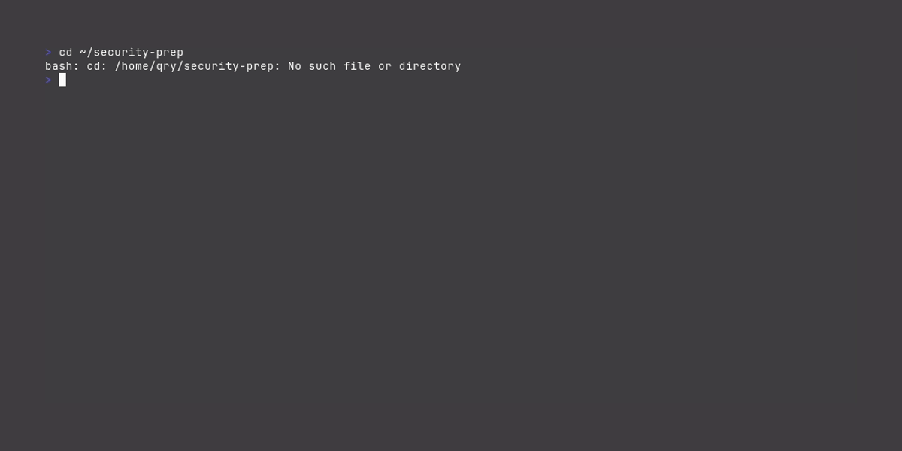

# ⚡ EXAMINATOR - Destroy Your Exams

**The Exam-Crushing Toolkit That Actually Works**

Built by students who were tired of failing. This automated pipeline transforms your messy study materials into exam-dominating content using smart text processing and battle-tested study techniques.

## 🎬 Quick Visual Guide

### 🚀 Installation (30 seconds)


### 📚 Basic Usage Pipeline


### 🧠 Interactive Flashcard Study Tool


*New to command line? These demos show everything you need to know!*

## 🚀 What's Included

### 📚 Study Materials
- **21 Cleaned Summaries** - Key concepts from all course materials, organized and deduplicated
- **6 Exam-Focused Guides** - Targeted study guides matching exact exam question patterns
- **Complete Practice Exam** - 100-point exam with 10 questions + 4 practical exercises
- **Additional Practice Questions** - 18 randomly generated questions for extra practice

### 🛠️ Automation Tools
- **PDF-to-Markdown Converter** - Extract text from any course PDF
- **Content Ingestion Pipeline** - Automatically process all materials
- **Summary Tidy Tool** - Clean up duplicates and formatting issues  
- **Exam-Focused Refinement** - Generate targeted study guides
- **Practice Question Generator** - Create unlimited practice questions
- **Interactive Flashcard App** - ADHD-friendly spaced repetition with zenburn theme

## 📋 Quick Start Guide

### 1. Setup (One-time)
```bash
# Install required packages
pip3 install textual --user --break-system-packages

# Optional: Install PyMuPDF for PDF conversion
pip3 install PyMuPDF --user --break-system-packages
```

### 🚨 Installation Issues?

**Python giving you grief? Try these alternatives:**

#### Option A: GitHub Codespaces (Recommended)
[](https://codespaces.new/QRY91/examinator)
- Click button above → Instant cloud environment
- Everything pre-installed, works in browser
- Perfect for exam crunch time

#### Option B: Docker One-Liner
```bash
docker run -it --rm -v $(pwd):/workspace python:3.11 bash
cd /workspace && pip install textual PyMuPDF
```

#### Option C: Replit
- Go to [replit.com](https://replit.com)
- Import from GitHub: `QRY91/examinator`
- Run in browser, no local install

**Still having issues?** Use the pre-made summaries in `output/` - just clone and study!

### 2. Add Your Materials
```bash
# Place PDFs and markdown files in the input/ directory
cp your-slides.pdf input/
cp your-assignments.md input/
```

### 3. Process Everything
```bash
# Convert PDFs to markdown and create summaries
python3 ingest.py

# Clean up duplicates and errors
python3 tidy.py --all

# Generate exam-focused guides
python3 refine.py

# Create practice questions
python3 generate-practice-questions.py
```

### 4. Study!
```bash
# Launch the flashcard app
python3 flashcards.py

# Or review the guides in output/refined/
```

## 📁 Directory Structure

```
security-prep/
├── input/                    # Your course materials (PDFs, markdown)
├── output/                   # Generated study materials
│   ├── refined/             # Exam-focused guides and practice exams
│   ├── *-summary.md         # Cleaned concept summaries
└── Tools:
    ├── ingest.py            # Process all materials automatically
    ├── tidy.py              # Clean up summaries  
    ├── refine.py            # Generate exam-focused guides
    ├── pdf-to-md.py         # Convert PDFs to markdown
    ├── flashcards.py        # Interactive study app
    └── generate-practice-questions.py  # Create practice exams
```

## 🎯 Key Features

### ✨ Smart Content Processing
- **Automatic PDF Extraction** - Converts slides to readable markdown
- **Intelligent Categorization** - Groups concepts by topic (Cryptography, Attacks, etc.)
- **Duplicate Removal** - Eliminates redundant information
- **Quality Filtering** - Removes malformed or incomplete concepts

### 🎪 Exam-Targeted Learning
- **Mock Exam Analysis** - Study guides based on actual exam question patterns
- **Expected Questions** - Predictions of likely exam content
- **Practical Exercises** - Hands-on problems matching exam format
- **Point Allocation** - Questions weighted by exam importance

### 🧠 ADHD-Friendly Study Tools
- **Smart Repetition** - Focuses on cards you struggle with (weight 2.0x)
- **Easy Card Suppression** - Reduces repetition of mastered content (weight 0.1x)
- **Zenburn Theme** - Easy on the eyes for long study sessions
- **Progress Tracking** - Visual feedback on learning progress

## 📖 Usage Examples

### Process New Course Materials
```bash
# Add new PDFs to input/
python3 ingest.py          # Extract and summarize
python3 tidy.py --all      # Clean up
python3 refine.py          # Update exam guides
```

### Create Custom Practice Exams
```bash
python3 generate-practice-questions.py
# Edit output/refined/practice-exam.md to customize
```

### Focus on Specific Topics
```bash
python3 tidy.py output/ch3-encryption-summary.md  # Clean specific file
# Review output/refined/cryptography-steganography-exam-guide.md
```

## 🎓 Study Strategy Recommendations

### 📅 24-Hour Exam Prep Timeline
**Days 1-2: Foundation**
1. Run complete processing pipeline on all materials
2. Review `output/refined/00-exam-overview.md`
3. Study each exam-focused guide in `output/refined/`

**Day 3: Practice & Review**
1. Complete `output/refined/practice-exam.md` 
2. Use flashcard app for weak areas
3. Review summaries for any knowledge gaps

**Final Hours: Intensive Review**
1. Review exam overview checklist
2. Practice drawing security model diagrams
3. Rehearse explaining key concepts out loud

### 🎯 Focus Areas (High Probability)
Based on mock exam analysis:
- **CIA Triad & Security Models** - Availability threats, Bell-LaPadula model
- **Cryptography** - Steganography vs encryption, HMAC process, classical ciphers
- **Web Security** - XSS types and mitigation strategies
- **Privacy** - K-anonymity calculations and implementation
- **Incident Response** - Four phases with specific examples

## 🤝 Contributing & Sharing

### For Classmates
1. **Fork/clone this repo** - Get your own copy
2. **Add your materials** - Put files in `input/`
3. **Run the pipeline** - Follow Quick Start guide
4. **Share improvements** - Submit pull requests for better questions/summaries

### Customization Ideas
- Add more question templates in `generate-practice-questions.py`
- Improve PDF extraction in `pdf-to-md.py`
- Enhance flashcard algorithm in `flashcards.py`
- Create topic-specific study guides

## 🔧 Troubleshooting

### Common Issues
**"No cards available" in flashcard app:**
```bash
python3 tidy.py --all  # Clean summaries first
python3 flashcards.py  # Try again
```

**PDF conversion fails:**
```bash
pip3 install PyMuPDF --user --break-system-packages
```

**Permission errors:**
```bash
chmod +x *.py  # Make scripts executable
```

**Python installation nightmare:**
- Use GitHub Codespaces (see Installation Issues section above)
- Or just use the pre-made summaries - no installation needed!

### Debug Mode
Add `--verbose` flag to any script for detailed output:
```bash
python3 ingest.py --verbose
```

## 📊 Success Metrics

After using this toolkit, you should be able to:
- ✅ Explain all major security concepts clearly
- ✅ Draw security model diagrams from memory  
- ✅ Identify and mitigate different attack types
- ✅ Apply privacy protection techniques
- ✅ Complete practice exams in under 3 hours
- ✅ Feel confident about exam success

## 🎉 Good Luck!

This toolkit represents hundreds of hours of development and refinement. Use it wisely, share improvements with classmates, and most importantly - **ace that exam!**

---
**Built with ❤️ for the Privacy & Security class**

*Remember: This toolkit enhances your studying but doesn't replace understanding the concepts. Make sure you truly comprehend the material, not just memorize it.* 